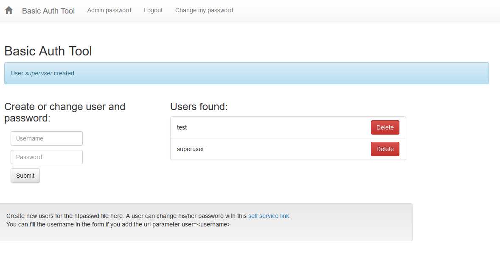

HTAdmin
=======

HTAdmin is a simple htpasswd editor implemented in PHP with a nice frontend (based on bootstrap). It's intended to update and maintain users and password hashes in a .htpasswd file. The admin has to create a user, but every user can change his password by himself using a self service area. It is also possible to send a password reset mail. You can use the .htpasswd with nginx and Apache, in the example we use nginx.

It comes with a preconfigured docker-compose.yml, so you don't have to install a LAMP stack locally for testing but can use docker instead.

You find the application in `sites/html/htadmin`.

After cloning set the appropriate rights, change `user` with your user:

`chown -R user:www-data app`

PHP needs write permission for the user www-data.

Create a config.ini within `app/htadmin/config` from the included example file `config.ini.example`.

Install a recent docker and docker-compose and run:

`docker-compose up -d`
 
After the build of the PHP image and startup of the containers point your browser to:

<http://localhost/htadmin/>

Standard access: admin / admin, make sure to change that in your `...config/config.ini` for other purposes than testing. You have to enter a hashed password, there is a tool for its generation included in the webapp:

<http://localhost/htadmin/adminpwd.php>

the .htaccess and .htpasswd files are configured for this folder:

<http://localhost/test/>

Uses the following libraries:

<https://github.com/PHPMailer/PHPMailer>

Enjoy!
